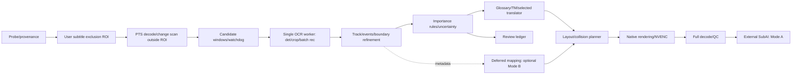

# 02 — So sánh kiến trúc và hợp đồng dữ liệu

## Ba phương án

| Phương án | Cấu trúc | Ưu điểm | Hạn chế / quyết định |
|---|---|---|---|
| A: Python + native libraries | FFmpeg/PyAV, OpenCV, RapidOCR/ORT, JSON/SQLite, libass/FFmpeg | Ít code mới, dễ đo/cô lập; công việc nặng đã native | Copy/object/threading và CPU ASS có thể nghẽn. **Chọn prototype/MVP có điều kiện đo** |
| B: C++ chọn lọc + Python | Như A nhưng scan/buffer/matching hoặc compositor qua pybind11 | Kiểm soát lifetime, copy và GPU surfaces | MSVC/CUDA/ABI và debugging tốn effort; không tự tăng tốc OCR. Chỉ sau profiler |
| C: Deep video tracking/VLM trung tâm | TransDETR/CoTracker/SAM2 + neural OCR/restoration | Có thể giải motion/occlusion khó | VRAM, license, Windows, load time, thiếu benchmark. **Loại khỏi MVP** |

Full C++ là biến thể B mở rộng: không chọn trước khi đo overhead Python. Cython cho vòng lặp số đã xác định; Nuitka cho packaging, không biến inference ngoài thành kernel CUDA nhanh hơn. FACT: OpenCV/PyAV có cơ chế thả GIL trong đoạn native; RapidOCR có batch crop; libass có cache glyph. Xem source [13](13_RESEARCH_SOURCES.md). HYPOTHESIS: phương án A đủ SLA; chưa đo.

## Pipeline và trách nhiệm

Probe không sửa timeline; discovery không quyết định IGNORE. OCR trả observation và transforms. Event builder tách update/cut/reappearance. Importance lưu reason/evidence; dịch giữ số và thuật ngữ; layout giữ thời gian/geometry; renderer giữ soundtrack và resolution; QC kiểm media và overlay coverage.

Pass phân tích trước, pass render sau là baseline. Chia sẻ decode/stream rendering chỉ xét khi metadata latency đã rõ: không giữ hàng phút frame trong RAM để chờ API. Metadata là ranh giới bền vững, sửa dịch/render không bắt chạy lại OCR.

## Contracts, đề xuất schema v1

| Contract | Trường bắt buộc và bất biến |
|---|---|
| VideoManifest | input_sha256, stream, codec, dimensions, rotation, SAR, color space/range, start_pts, time_base `{num,den}`, PTS index ref, run/code/config/model/runtime hashes |
| FrameRef | integer pts + rational time_base, decode/presentation index, source geometry, source_to_analysis_transform. VFR không suy thời gian bằng index/fps |
| TextObservation | frame_ref, source polygon, detector/text scores, raw text, crop hash/quality, orientation, preprocessing transform, model/provider/timings; missing confidence=null |
| TextEvent | event/shot/track/parent_panel/appearance/revision ID, half-open start/end PTS, boundary uncertainty, geometry keyframes, observations/evidence refs, canonical text, typed fields, lifecycle/confidence |
| Decision | category, selected, confidence, rule/adapter versions, context IDs, reason codes, review_required; selected=false có nguyên nhân |
| Translation | source/target fields, glossary version, term IDs, context hash, translator/model/prompt version, cache key, numeral validation, source-target links, shortening/review status |
| OverlayPlan | event/time interval, target canvas/mapping, level, anchors/keyframes, text/font hashes, occupied/forbidden polygons, alpha assets, unresolved collisions |
| RunReport | actual wall/stage spans/critical path/load, CPU/RAM/GPU/VRAM, queue bytes, API calls/cost nếu biết, omissions/reviews, media/QC, SLA/quality/compatibility riêng |

Cùng text xuất hiện lại: appearance khác. HP thay số: revision khác. Translation cache reuse không reuse time/geometry. Không chứa secrets trong contracts. Resume chỉ khi provenance/schema/version khớp.

## Điều phối

Một decode producer, một OCR owner GPU, event consumer nhẹ; queue giới hạn **byte**, backpressure không drop candidate. Một cặp det/rec load một lần, không duplicate session. Batch crop theo width/aspect, mapping ID trả đúng thứ tự. Translation mạng giới hạn concurrency, không VLM resident cùng OCR mặc định trên 4 GB.

Mốc khảo sát 2–4 CPU threads cho native preprocessing/runtime, không phải cấu hình đã tối ưu. Cộng thời gian exclusive; inference nằm trong OCR tổng không cộng lần nữa. Unknown API cost/quality vẫn unknown. Chỉ kết luận B tốt hơn khi profiler cho thấy phần thay C++ có tỷ trọng và benchmark A/B vượt sai số đo.

## Contract SubtitleExclusionROI

User-confirmed rect/polygon, display_to_source_transform, source pixels/normalized coordinates, active PTS intervals, roi_hash/version. VideoManifest/cache khóa exclusion hash. Thứ tự: probe/preview → user khoanh sub → submit → discovery/OCR ngoài ROI. Không lọc sau khi đã nhận diện sub. Renderer dành ROI cho SubAI, tránh overlay mặc định. Coverage report EXCLUDED_BY_USER không đọc text bên trong.
