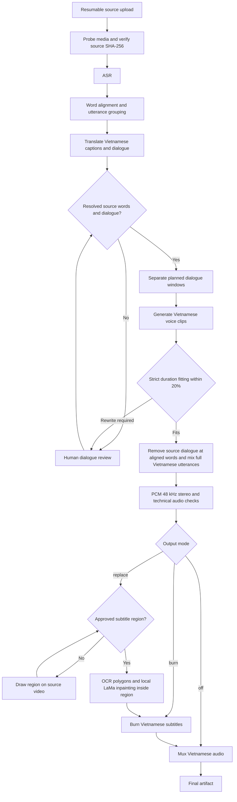

# Pipeline runtime and recovery

This document describes the runtime changes developed from `01d9e7c`. Validation results are recorded separately; source implementation alone is not evidence of inference quality.

## Processing order

No dubbed segments means original audio passthrough: separation and TTS are skipped. Technical completion does not prove transcription accuracy, natural speech, correct speaker identity, or subtitle removal quality.

## Review and output controls

The user-selected default voice is **Ngọc Huyền**. Keep this default until the user explicitly requests a change. Runtime settings, the TTS worker, and the VieNeu adapter share the same default. Explicit `VOICE_ID` or per-segment voice choices are supported; do not add automatic voice switching.

New uploads default to `replace`: Vietnamese dubbing, source subtitle removal, and Vietnamese captions. The uploader can choose `burn` or `off`. Legacy episodes without an upload flag use `SUBTITLE_MODE` (default `off`).

The dialogue editor reads and writes `/api/episodes/{id}/segments`. Editing is allowed only at `NEEDS_REVIEW` or `CHECKPOINTED`; the API preserves source confidence provenance and segment identity, rejects mismatched episode IDs and invalid timelines, and requires an explicit DUB/KEEP decision for each line. Voice and speaker labels can be set manually. Automatic speaker diarization is outside these changes.

A strict timing mismatch stops before mixing; the user shortens the Vietnamese line or chooses KEEP. Words can be reviewed against the original video. The pipeline does not silently cut voice tails to meet the slot.

Subtitle replacement requires a normalized ROI. `/api/episodes/{id}/roi` accepts a region for the episode or series during region review. It cannot edit an actively rendering episode. Unsupported frame timelines or unverified renderer results hold processing for review. Inpainting modifies detected polygons only before video encoding; lossy video encoding can change pixels throughout the frame.

## Durability and stopping

Model stages reuse valid recorded results; timing, mixing and QC are currently recomputed/revalidated on resume. Stage checkpoints live at `DATA_DIR/checkpoints/{episode_id}/state.json`. Schema 2 records source identity, runtime configuration, per-stage inputs/results, completed stages, next stage, and artifact hashes. Preparation checkpoints from schema 1 remain recognized. A stage result is reusable only when its recorded inputs and artifacts are valid; edits invalidate dependent work.

Drain requests stop scheduling new episodes and hold the active episode at a durable stage boundary. Shutdown cancels model process groups. Restart recovers interrupted stages, and resume requeues requested checkpoints. Original uploads and their hashes remain intact. Deletion is blocked for active episodes.

A corrupted derived artifact invalidates its stage and dependants, leaves the episode FAILED, and permits an explicit retry using earlier valid results. Invalid source or checkpoint identity is a hard failure. Do not manually erase checkpoints or replace uploads to bypass this gate; diagnose the failing artifact and source first.

## Cloud installation and verification

Local development contains source changes only. Restore, dependency checks, Python tests, FFmpeg checks, frontend builds, and model inference run on the rented cloud host.

`cloud_bootstrap.sh` supports Ubuntu 22.04 and 24.04, using managed Python 3.12 where Ubuntu does not package it. `setup_new_server.sh` uses the actual `model_assets fetch/verify --only ...` interface, fails on installation errors, builds the frontend, and does not restart an existing worker automatically.

The launcher stores a generated admin token in `DATA_DIR/run/admin_token.txt` with owner-only permissions. It preserves a process that has not finished graceful shutdown instead of force-killing it after one second.

A Drive backup is a transport artifact, not proof that Python virtual environments are portable across hosts. Restore into staging, select only approved model/environment paths, repair interpreter links where necessary, and validate each environment before inference. Credentials remain in protected cloud rclone configuration; they must not be committed or copied into this document.
